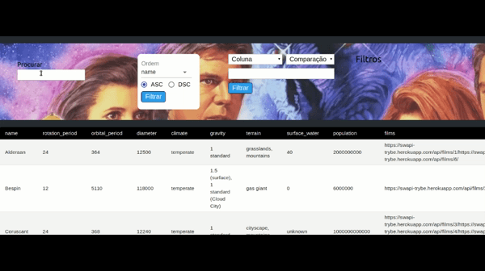

# Projeto Star Wars DataTable Filters (com Redux)!

Este projeto foi feito para avaliação de meus conhecimentos sobre _react/redux_ no curso de _Software Development_ ofertado pela Trybe.

## O que foi desenvolvido:

Criei um projeto em React utilizando Redux para controle de estado. A aplicação consiste numa tabela com informações acerca de todos os planetas existentes no universo fictício da série _Star Wars_. A tabela foi alimentada com dados retornados de uma API real. Há, também, vários filtros que permitirão a quem usa selecionar e encontrar com facilidade a informação desejada.
## Instruções para execução

1 - Clone este repositório

`git clone git@github.com:laurolyra/my-projects.git`

2 - Vá para a pasta do projeto

`cd StarWarsRedux`

3 - Instale as dependências

`npm install`

4 - Inicie a aplicação

`npm start`

# Requisitos Obedecidos

Todos os requisitos abaixo constituem regras de negócio definidas pela escola, as quais não pude alterá-las para uma outra arquitetura ou uso de outra tecnologia.

### 1 - Fazer uma requisição para o endpoint `/planets` da API de Star Wars e preencher uma tabela com os dados retornados, com exceção dos da coluna `residents`

A tabela deve ser renderizada por um componente chamado `<Table />`. Os dados recebidos da API devem ser salvos num campo chamado `data` do `store` e é daí que a tabela deve lê-los. A requisição deve ser feita num componente separado do componente da tabela.

A tabela deve ter uma primeira linha com os headers e as demais com as informações de cada campo. Essa linha será considerada nos testes, então caso um teste busque por oito linhas na tabela, serão sete linhas com as informações sobre os planetas e uma referente aos headers.

### 2 - Sua página deve ter um campo de texto que filtra a tabela para somente exibir planetas cujos nomes incluam o texto digitado

Ele deve atualizar a tabela com os planetas que se encaixam no filtro à medida que o nome é digitado, sem ter que apertar um botão para efetuar a filtragem. Por exemplo, se digitar "Tatoo", o planeta "Tatooine" deve ser exibido. Você deve usar **Redux** para fazer o gerenciamento do estado da aplicação e o texto digitado deve ser salvo num campo `filters: { filterByName: { name } }`. É muito importante que `filterByName` esteja dentro de `filters`, como no exemplo a seguir:

```javascript
{
  filters: {
    filterByName: {
      name: 'Tatoo'
    }
  }
}
```

O campo de texto deve possuir a propriedade `data-testid='name-filter'` para que a avaliação automatizada funcione.



### 3 - Sua página deve ter um filtro para valores numéricos

Ele funcionará com três seletores:

  - O primeiro deve abrir um dropdown que permita a quem usa selecionar uma das seguintes colunas: `population`, `orbital_period`, `diameter`, `rotation_period` e `surface_water`. Deve ser uma tag `select` com a propriedade `data-testid='column-filter'`;
  - O segundo deve determinar se a faixa de valor será `Maior que`, `Menor que` ou `Igual a` o numero que virá a seguir. Uma tag `select` com a propriedade `data-testid='comparison-filter'`;
  - O terceiro deve ser uma caixa de texto que só aceita números. Essa caixa deve ser uma tag `input` com a propriedade `data-testid='value-filter'`;
  - Deve haver um botão para acionar o filtro, com a propriedade `data-testid='button-filter'`.

A combinação desses três seletores deve filtrar os dados da tabela de acordo com a coluna correspondente e com os valores escolhidos. Por exemplo:
  - A seleção `population | maior que | 100000` - Seleciona somente planetas com mais de 100000 habitantes.
  - A seleção `diameter | menor que | 8000` - Seleciona somente planetas com diâmetro menor que 8000.

Você deve usar **Redux** para fazer o gerenciamento do estado da aplicação. No `store`, esses valores devem ser salvos nos campos `filters { filterByName: { name }, filterByNumericValues: [{ column, comparison, value }] }`. Tenha em mente que a avaliação automatizada exige que o estado inicial da chave `filterByNumericValues` seja um array vazio, `[]`. Veja um exemplo de como o estado deve ficar quando uma filtragem for feita:

```javascript
{
  filters:
    {
      filterByName: {
        name: ''
      },
      filterByNumericValues: [
        {
          column: 'population',
          comparison: 'maior que',
          value: '100000',
        }
      ]
    }
  }
}
```


### 4 - Sua página deverá ser carregada com somente um filtro de valores numéricos

Após clicar no botão com o data-testid `button-filter`, sua aplicação deve permitir que quem a usa adicione um novo filtro numérico sem que precise deletar o filtro anterior. Ou seja: dado que você usa três elementos para configurar o seu filtro numérico, após clicar no botão esses três elementos devem permanecer na tela e funcionais na filtragem da tabela, mas três novos elementos devem ser adicionados para que, assim, quem usa pode selecionar um novo filtro numérico. Além disso, no dropdown de colunas desse novo filtro não deve mais haver a coluna que já foi selecionada no filtro anterior. Caso todas as colunas já tenham sido incluídas em filtros anteriores, ao atualizar o filtro nenhuma das colunas devem estar disponíveis. Você deve usar **Redux** para fazer o gerenciamento do estado da aplicação.

Por exemplo: imagine que você selecionou no primeiro filtro numérico as seguintes seleções: `population | maior que | 100000`. Após clicar no botão com data-testid `button-filter` deve ser possível adicionar um segundo filtro, além deste. No dropdown desse novo filtro a se adicionar, a opção `population` não deve aparecer. Em resumo, seus filtros numéricos não podem repetir as colunas que selecionam. Se no segundo filtro fosse selecionado `diameter | menor que | 8000`, o estado ficaria assim:

```javascript
{
  filters: {
    filterByName: {
      name: ''
    },
    filterByNumericValues: [
      {
        column: 'population',
        comparison: 'maior que',
        value: '100000',
      },
      {
        column: 'diameter',
        comparison: 'menor que',
        value: '8000',
      }
    ]
  }
}
```


### 5 - Cada filtro de valores numéricos deve ter um ícone de `X` que, ao ser clicado, o apaga e desfaz suas filtragens dos dados da tabela

A coluna que este filtro selecionava deve passar a ficar disponível nos dropdowns dos demais filtros já presentes na tela. Você deve usar **Redux** para fazer o gerenciamento do estado da aplicação. Cada filtro deve possuir a propriedade `data-testid='filter'`, com um `button` em seu interior com o texto `X`.


---

### Implementações técnicas

Algumas coisas devem seguir um padrão pré-estabelecido para que a avaliação automatizada aprove a implementação.

#### Provider

É preciso que o `store` seja provido para a aplicação no `index.js`. Caso contrário não será possível realizar os testes, pois como você viu para testar uma aplicação que utiliza **Redux** é necessário que os testes provejam à aplicação um store próprio, substituindo um que deve ser declarado no `index.js`.

#### Reducers

Nos testes, para a criação do `store`, é utilizado o `reducer` que você desenvolveu, então para que os testes ocorram como o previsto é preciso que seu `reducer` final seja exportado de `src/reducers/index.js`, pois é desse caminho que o arquivo de testes fará a importação dele.

---
